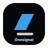

<!-- Naranjan Singh • Complete GitHub-native personal branding system -->
<div align="center">
  
</div>

<!-- Premium contact strip -->
<p align="center">
  <a href="https://naranjansingh.online"></a>
  <a href="https://linkedin.com/in/naranjan-singh-556964248/"></a>
  <a href="mailto:inaranjanshahi@gmail.com"></a>
  
</p>


<!-- ABOUT: premium glass card rendered with GitHub Markdown -->
## About

<table>
<tr>
<td width="58%">

### Naranjan Singh

I design and ship polished mobile products with **Flutter**, **Firebase**, and clean API-driven architecture. My focus is product-quality UI, stable state management, maintainable codebases, and release-ready Android/iOS experiences for real businesses.

- **Role:** Flutter Developer
- **Experience:** 3+ Years
- **Location:** Punjab, India
- **Principles:** minimal interfaces, dependable architecture, fast iteration, elegant motion

</td>
<td width="42%">

```dart
final engineer = MobileCraftsperson(
  name: 'Naranjan Singh',
  stack: ['Flutter', 'Dart', 'Firebase'],
  architecture: ['Clean', 'MVVM', 'MVC'],
  output: 'Production mobile applications',
);
```

</td>
</tr>
</table>

<!-- TECH STACK: custom SVG icon system -->
## Tech Stack

<p align="center">
       
<br/>
      
<br/>
       
</p>

<!-- EXPERIENCE: premium vertical timeline -->
## Experience Timeline

| Era | Company | Focus |
|---|---|---|
| ◆ | **Ridhab Techno** | Flutter applications, Firebase modules, API integrations, production builds |
| ◆ | **RSITHUB** | Mobile UI systems, state management, Android/iOS delivery workflows |
| ◆ | **Excellence Technology** | Scalable app architecture, client features, release quality improvements |

<!-- FEATURED PROJECTS: handcrafted product cards -->
## Featured Projects

| Project | Architecture | Features |
|---|---|---|
| **RoomChat** | Flutter, Firebase, WebSocket | Real-time chat, authentication, message flows, responsive mobile UI |
| **Pikaaya Customer** | Flutter, REST API, Provider/GetX | Customer ordering journey, maps, notifications, payment-ready flows |
| **Pikaaya Rider** | Flutter, Google Maps, Firebase | Rider tracking, task states, live updates, optimized field workflow |
| **India Nikah** | Flutter, Firebase Auth, Firestore | Secure onboarding, profiles, matchmaking flows, notification touchpoints |
| **Guide Traveller** | Flutter, REST API, MVVM | Travel discovery, booking-friendly UI, structured data presentation |
| **Portfolio** | Web, SEO, Brand System | Personal identity, case-study routing, responsive professional presence |

<p align="center">
  
</p>

<!-- GITHUB STATS: aligned dark widgets -->
## GitHub Intelligence

<p align="center">
  
  
</p>
<p align="center">
  
</p>
<p align="center">
  
</p>

<!-- SNAKE: generated daily by GitHub Actions -->
## Contribution Motion

<p align="center">
  
</p>

<!-- RECENT ACTIVITY: updated by workflow -->
## Recent Activity

<!-- ACTIVITY:START -->
- Refined **naranjansingh/profile** profile branding system on **2026-07-29**.
- Latest pipeline run: `30427324547` • commit `c9b466a`.
- Profile automation keeps activity, quotes, blog hooks, and snake assets fresh.
<!-- ACTIVITY:END -->

<!-- BLOG SECTION: GitHub-safe, easy to configure -->
## Writing & Notes

<!-- BLOG-POST-LIST:START -->
- **Production Flutter UI** — patterns for clean, scalable mobile interfaces.
- **Firebase App Foundations** — authentication, Firestore, storage, and notifications as one system.
- **Mobile Release Quality** — reducing bugs before Play Store and App Store delivery.
<!-- BLOG-POST-LIST:END -->

<!-- QUOTE SECTION: refreshed daily by script -->
## Engineering Quote

<!-- QUOTE:START -->
> “Great products feel obvious after they exist.” — **Product Engineering Principle**
<!-- QUOTE:END -->

<!-- FOOTER: custom animated SVG plus social destinations -->
<div align="center">
  
  <br/>
  <a href="https://naranjansingh.online">Portfolio</a> •
  <a href="https://linkedin.com/in/naranjan-singh-556964248/">LinkedIn</a> •
  <a href="mailto:inaranjanshahi@gmail.com">Email</a> •
  <a href="https://github.com/NaranjanSingh">GitHub</a>
</div>
