<!-- Naranjan Singh • GitHub-native premium personal brand system -->

  

<!-- Premium contact and credibility strip -->

  
  
  
  

<!-- METRICS: recruiter-friendly proof points -->
## Impact Metrics

  
  
  
  
  
  

<!-- ABOUT: short premium summary -->
## About

> Flutter Engineer with **3+ years of experience** building scalable Android & iOS applications. Specialized in **Firebase**, **REST APIs**, **Clean Architecture**, real-time systems, payment integrations, and production deployments. Passionate about smooth user experiences and maintainable codebases.

<!-- TECH STACK: categorized for fast reading. Brand logos are resolved by scripts/fetch-official-icons.js with Devicon → Simple Icons → legal fallback order. -->
## Tech Stack

<table>
<tr>
<td width="25%" valign="top">

### Mobile
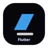  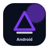 

</td>
<td width="25%" valign="top">

### Backend
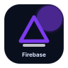   

</td>
<td width="25%" valign="top">

### Architecture
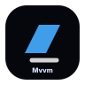  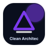  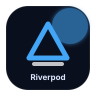  

</td>
<td width="25%" valign="top">

### DevOps & Product
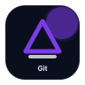    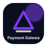  

</td>
</tr>
</table>

<!-- EXPERIENCE: premium timeline cards -->
## Experience Timeline

<table>
<tr><td width="4%">●</td><td>

### Ridhab Techno — Flutter Developer
**2025–Present**  
Production Apps · Firebase · Payments · Maps · Android/iOS Releases

</td></tr>
<tr><td colspan="2">
</td></tr>
<tr><td width="4%">●</td><td>

### RSITHUB — Flutter Developer
**2023–2025**  
Mobile UI Systems · REST API Integrations · State Management · Release Workflows

</td></tr>
<tr><td colspan="2">
</td></tr>
<tr><td width="4%">●</td><td>

### Excellence Technology — Flutter Developer
**Early Career**  
Client Features · App Architecture · Firebase Modules · Product Iteration

</td></tr>
</table>

<!-- FEATURED PROJECTS: screenshot-led case study cards -->
## Featured Projects & Case Studies

### RoomChat — Nearby Social Platform

**Tech:** Flutter · Firebase · Firestore · Firebase Auth · Cloud Messaging · Location · Clean Architecture  
**Scale:** 20,000+ lines of Flutter focused on realtime communication and discoverability.  
**Features:** Realtime chat, nearby users, notifications, profile flows, scalable data models.  
<a href="https://github.com/naranjansingh?tab=repositories">GitHub</a> · <a href="https://naranjansingh.online">Live</a> · <a href="https://naranjansingh.online">Case Study</a>

### Pikaaya Customer — Commerce Customer App

**Tech:** Flutter · REST APIs · Provider/GetX · Google Maps · Payments · Push Notifications  
**Features:** Customer ordering journey, map-aware flows, payment-ready checkout, status updates.  
<a href="https://github.com/naranjansingh?tab=repositories">GitHub</a> · <a href="https://naranjansingh.online">Live</a> · <a href="https://naranjansingh.online">Case Study</a>

### Pikaaya Rider — Delivery Operations App

**Tech:** Flutter · Google Maps · Firebase · REST APIs · Cloud Messaging  
**Features:** Rider job states, delivery tracking, live updates, route-ready interface patterns.  
<a href="https://github.com/naranjansingh?tab=repositories">GitHub</a> · <a href="https://naranjansingh.online">Live</a> · <a href="https://naranjansingh.online">Case Study</a>

### India Nikah — Matrimonial Platform

**Tech:** Flutter · Firebase Auth · Firestore · Storage · Notifications  
**Features:** Secure onboarding, profile management, discovery flows, notification touchpoints.  
<a href="https://github.com/naranjansingh?tab=repositories">GitHub</a> · <a href="https://naranjansingh.online">Live</a> · <a href="https://naranjansingh.online">Case Study</a>

### Guide Traveller — Travel Discovery App

**Tech:** Flutter · REST APIs · MVVM · Maps · Structured Content  
**Features:** Travel discovery, guide details, clean information hierarchy, booking-friendly UI.  
<a href="https://github.com/naranjansingh?tab=repositories">GitHub</a> · <a href="https://naranjansingh.online">Live</a> · <a href="https://naranjansingh.online">Case Study</a>

### Portfolio — Personal Brand Website

**Tech:** Web · SEO · Motion · Brand System · Responsive UI  
**Features:** Professional positioning, case-study routing, accessible interface, fast-loading content.  
<a href="https://github.com/naranjansingh?tab=repositories">GitHub</a> · <a href="https://naranjansingh.online">Live</a> · <a href="https://naranjansingh.online">Case Study</a>

<!-- REPOSITORY STRATEGY: tells HR what to inspect -->
## Recommended Pinned Repositories

| Repository | What HR / Clients Should See |
|---|---|
| **RoomChat** | README, screenshots, GIF demo, architecture, folder structure, installation, features |
| **Pikaaya** | Customer/rider flows, maps, payments, API integration, production decisions |
| **Guide Traveller** | Travel UX, REST API usage, MVVM structure, responsive screens |
| **Portfolio** | Brand thinking, SEO, case studies, contact conversion |
| **Flutter Components** | Reusable widgets, animation patterns, forms, empty states, loaders |
| **Flutter Animations** | Micro-interactions, SVG motion, premium UI experiments |

<!-- TESTIMONIALS: social proof cards -->
## Testimonials

| Rating | Signal |
|---|---|
| ★★★★★ | Developed multiple production apps with dependable Flutter implementation. |
| ★★★★★ | Successfully delivered scalable Flutter applications for business workflows. |
| ★★★★★ | Strong UI/UX thinking paired with clean architecture and reliable delivery. |

<!-- GITHUB STATS: fixed to lowercase verified username and stable endpoints -->
## GitHub Intelligence

  
  

  

  

<!-- SNAKE: generated daily by GitHub Actions -->
## Contribution Motion

  

<!-- RECENT ACTIVITY: updated by workflow -->
## Recent Activity

<!-- ACTIVITY:START -->
- Refined **naranjansingh/profile** profile branding system on **2026-08-20**.
- Latest pipeline run: `32325477609` • commit `8b88625`.
- Profile automation keeps activity, quotes, blog hooks, and snake assets fresh.
<!-- ACTIVITY:END -->

<!-- BLOG SECTION: GitHub-safe, easy to configure -->
## Writing & Notes

<!-- BLOG-POST-LIST:START -->
- **Production Flutter UI** — patterns for clean, scalable mobile interfaces.
- **Firebase App Foundations** — authentication, Firestore, storage, and notifications as one system.
- **Mobile Release Quality** — reducing bugs before Play Store and App Store delivery.
<!-- BLOG-POST-LIST:END -->

<!-- QUOTE SECTION: refreshed daily by script -->
## Engineering Quote

<!-- QUOTE:START -->
> “Make it work, make it right, make it fast.” — **Kent Beck**
<!-- QUOTE:END -->

<!-- FOOTER: custom animated SVG plus social destinations -->

  
   
  <a href="https://naranjansingh.online">Portfolio</a> •
  <a href="https://linkedin.com/in/naranjan-singh-556964248/">LinkedIn</a> •
  <a href="mailto:inaranjanshahi@gmail.com">Email</a> •
  <a href="https://github.com/naranjansingh">GitHub</a>

